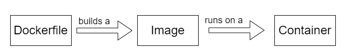

## Getting Started with Docker

### What is Docker?

Docker is an open-source project that automates the deployment of applications inside software containers. Docker is a tool designed to make it easier to create, deploy, and run applications by using containers. Containers allow a developer to package up an application with all of the parts it needs, such as libraries and other dependencies, and ship it all out as one package. By doing so, thanks to the container, the developer can rest assured that the application will run on any other Linux machine regardless of any customized settings that machine might have that could differ from the machine used for writing and testing the code.

There are two ways to get started with Docker. You can either install Docker on your local machine or use a cloud service like [Docker Hub](https://hub.docker.com/). In this tutorial, we will be using Docker Hub. If you want to install Docker on your local machine, you can follow the instructions [here](https://docs.docker.com/get-docker/).

### Docker Hub

Docker Hub is a cloud service that allows you to create and manage Docker containers. You can create a free account [here](https://hub.docker.com/signup). Once you have created an account, you can create a new repository by clicking on the `Create` button on the top right corner of the page. You can name your repository anything you want. For this tutorial, we will name our repository `dockerized-react-app`

### Docker Eco-System

Docker is made up of three main components: Docker Engine, Docker Hub, and Docker Compose. Docker Engine is the open source application that provides the ability to create and run containers. Docker Hub is a cloud service that allows you to create and manage Docker containers. Docker Compose is a tool for defining and running multi-container Docker applications.

### Docker Workflow



The Docker workflow consists of the following

**1.** Create a Dockerfile and .dockerignore file (if necessary)

**2.** Build the image

> In case you already have a docker image or you are pulling an image from DockerHub and you want to create a container from it, you can skip above steps and go to step 3.

**3.** Run the container

#### 1. Create a Dockerfile and .dockerignore file

The **_Dockerfile_** is a text file that contains all the commands a user could call on the command line to assemble an image. The `Dockerfile` is a set of instructions that Docker will run one by one. Each instruction in the `Dockerfile` creates a layer in the image. When you change the `Dockerfile` and rebuild the image, only those layers that have changed are rebuilt. This provides a much faster build process than building an image from scratch.

[Example Dockerfile](../Dockerfile)

The **_.dockerignore_** file is a text file that contains a list of files and directories that Docker should ignore when building the image. This is useful if you have files that you don’t want to include in the image, such as source code, a large number of files, or secret files.
Create a new file in the root directory of your project and name it `Dockerfile`. The `Dockerfile` is a text file that contains all the commands a user could call on the command line to assemble an image. The `Dockerfile` is a set of instructions that Docker will run one by one. Each instruction in the `Dockerfile` creates a layer in the image. When you change the `Dockerfile` and rebuild the image, only those layers that have changed are rebuilt. This provides a much faster build process than building an image from scratch.

[Example .dockerignore file](../.dockerignore)

#### 2. Build the image

To build the image, run the following command in the root directory of your project:

```terminal
docker build -t <your_dockerhub_username>/<your_repository_name>:version .
```

This command will build the image and tag it with the name you specified. The `.` at the end of the command is very important. It tells Docker to look for the `Dockerfile` in the current directory.

#### Pushing the image to Docker Hub

To push the image to Docker Hub, run the following command:

```terminal
docker push <your_dockerhub_username>/<your_repository_name>
```

or you can also use the image id instead of the name

```terminal
docker push <image_id>
```

#### Pulling the image from Docker Hub

To pull the image from Docker Hub, run the following command:

```terminal
docker pull <your_dockerhub_username>/<your_repository_name>:version
```

#### 3. Run the container

To run the container, run the following command:

```terminal
docker run -p 5000:3000 <your_dockerhub_username>/<your_repository_name>
```

oryou can also use the image id instead of the name

```terminal
docker run -p 5000:3000 <image_id>
```

This command will run the container and map port 5000 of your machine to port 3000 of the container. You can now access your app on `localhost:5000`

### Other Useful Docker Commands

List all the images on your machine

```terminal
docker images
```

List all the running containers

```terminal
docker ps
```

List all the containers (running and stopped)

```terminal
docker ps -a
```

Stop a running container

```terminal
docker stop <container_id>
```

Remove a container

```terminal
docker rm <container_id>
```

Remove an image

```terminal
docker rmi <image_id>
```
